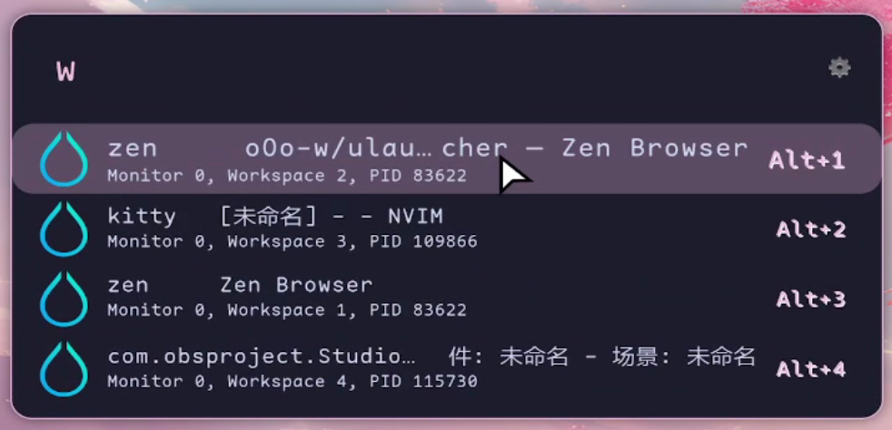

# Hyprland Window Switcher for Ulauncher

## Overview

This is a Ulauncher extension designed for the Hyprland window manager, allowing users to quickly search and switch between open windows.

<div style="text-align: center;">
    
</div>

## Installing

This extension only requires `hyprctl` to work. So what you need is:
- [ulauncher](https://ulauncher.io/) 
- [hyprland](https://hyprland.org/)

Install the repo via Ulauncher → Preferences → Extensions → Add Extension
```
https://github.com/oOo-w/ulauncher-hypr-window-switcher
```

## Usage
1. Press the shortcut key (default `w`) to open the window switcher.
2. Type the window title or class name to filter the list of windows.
3. Select the desired window and press `Enter` to switch to it.


